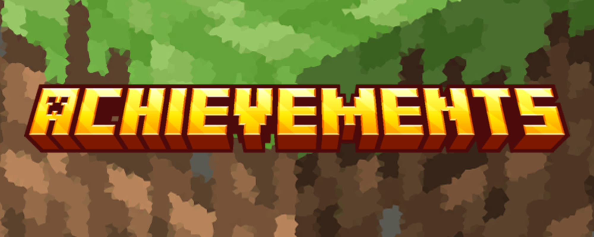

# Achievements MC
A simple minecraft plugin for server owners to create achievements for players to work towards

[Video demo](https://youtu.be/vzvP3moF748)

### Installation
The best way to get this plugin is on [Modrinth](https://modrinth.com/plugin/achievements-mc), but you can also get the latest build from the releases tab, or an in-dev build from the actions tab. Just know that this project can only run on paper servers 1.21+

After installing, you will need to set up an SQL server in the `config.yml` file. All the tables are created automatically, so all you need to do is fill in the information.

## Usage
In order to set up achievements, the user must have the `achievements-mc.edit-achievements` permission. To open the editor menu, you must use the `/editachievements` command.

Once you set up an achievement, players can view them in the achievements menu using `/achievements` or by clicking on the chat message when they complete a tier.